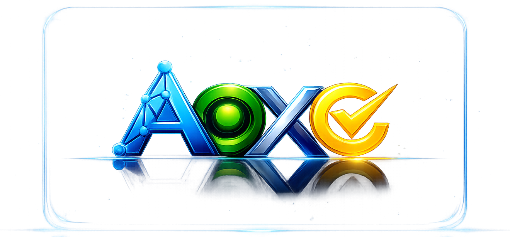

<div align="center">
  

  <h1>AOXChain</h1>

  <p>
    <strong>Auditable coordination infrastructure for modular multi-chain interoperability</strong>
  </p>

  <p>
    AOXChain is building a disciplined and extensible foundation for cross-chain
    communication, programmable execution, governance coordination, and value routing.
  </p>

  <p>
    
    
    
    
    
  </p>

  <p>
    
    
    
    
    
  </p>
</div>


---

## Overview

AOXChain is an alpha-stage blockchain infrastructure initiative focused on interoperability with structure.

The project is designed to help multiple blockchain environments work together through a modular coordination model that emphasizes:

- secure cross-chain messaging
- consistent execution logic
- auditable operational flows
- explicit governance surfaces
- long-term architectural clarity

Rather than treating interoperability as a collection of disconnected bridges or integrations, AOXChain positions it as a unified infrastructure problem that should be solved with discipline, visibility, and upgradeability.

---

## Vision

AOXChain aims to become a reliable interoperability foundation for ecosystems that need more than simple token transfer.

Its long-term direction is to support coordinated multi-chain systems where messaging, execution, value movement, and governance can evolve together without forcing a full architectural reset every time the network expands.

In practical terms, the vision is to create infrastructure that is:

- modular enough to support multiple chain categories
- structured enough to remain understandable as it grows
- transparent enough to support auditing and operational trust
- flexible enough to adapt to future execution models

---

## What AOXChain Solves

As blockchain ecosystems mature, the challenge is no longer only launching smart contracts or moving assets between networks.
The real challenge is coordination.

AOXChain is intended to address common ecosystem problems such as:

| Challenge | AOXChain Response |
|---|---|
| Fragmented interoperability models | Introduces a more unified coordination architecture |
| Inconsistent cross-chain messaging | Promotes structured and verifiable communication pathways |
| Weak governance visibility | Defines clearer operational and administrative control surfaces |
| Difficult execution coordination | Supports modular execution across different environments |
| Poor system transparency | Encourages traceability, auditability, and clearer system behavior |

---

## Core Architecture Model

AOXChain can be understood as a layered coordination framework.

### 1. Coordination Layer
Defines how connected blockchain environments interact, synchronize, and follow shared operating rules.

### 2. Messaging Layer
Handles cross-network communication, event propagation, and structured signal delivery.

### 3. Execution Layer
Supports coordinated execution across different environments while preserving system consistency.

### 4. Value Routing Layer
Focuses on secure asset movement, transfer logic, and cross-chain value representation.

### 5. Governance Layer
Provides administrative control, policy management, and upgrade pathways.

### 6. Visibility Layer
Improves monitoring, inspectability, and audit-oriented understanding of system behavior.

---

## System View

```text
Users / Builders / Partners
           │
           ▼
    AOXChain Coordination
           │
   ┌───────┼────────┬────────┬────────┬────────┐
   ▼       ▼        ▼        ▼        ▼        ▼
Messaging Execution Routing Governance Visibility Expansion
           │
           ▼
 Connected Chain Categories
```

This model reflects a long-term interoperability strategy rather than a narrow single-network product direction.

---

## Design Principles

AOXChain is being shaped around a small set of durable principles:

- **Clarity first** — every layer should have a defined role.
- **Deterministic thinking** — behavior should remain understandable and inspectable.
- **Modularity by design** — components should evolve without breaking the entire system model.
- **Governance with intent** — control surfaces should be explicit, not improvised.
- **Auditability as a feature** — transparency should be built into the architecture.
- **Expansion without narrative drift** — growth should reinforce the design rather than dilute it.

---

## Why It Matters

Many interoperability projects communicate ambition, but not enough structure.
AOXChain is intended to present both.

The goal is to build infrastructure that is:

- technically serious
- partner-friendly
- easy to understand at a high level
- flexible enough for future integration paths
- stable enough to support long-term ecosystem identity

This makes AOXChain relevant not only for builders, but also for partners, researchers, operators, and communities evaluating the long-term quality of multi-chain infrastructure.

---

## Current Stage

AOXChain is currently in **alpha**.

At this stage, the priority is not feature overload.
The priority is establishing a strong and credible foundation for:

- interoperability architecture
- execution coordination
- governance structure
- operational visibility
- scalable ecosystem growth

---

## Audience

AOXChain is relevant for:

- builders creating cross-chain applications
- infrastructure teams exploring modular interoperability systems
- ecosystem partners evaluating coordination layers
- researchers studying multi-chain architecture design
- strategic contributors focused on long-term infrastructure quality

---

## Repository Purpose

This repository is used to present the AOXChain identity and project direction through GitHub profile and documentation content.

As the ecosystem evolves, this space can expand to include:

- ecosystem overview materials
- public architecture notes
- contribution guidance
- branding and communication assets
- documentation for future modules and integrations

---

## Closing Note

AOXChain is being designed as infrastructure, not just as a narrative.

The emphasis is on building a modular interoperability foundation that remains clear, auditable, and expandable as multi-chain coordination becomes more important across the blockchain landscape.
