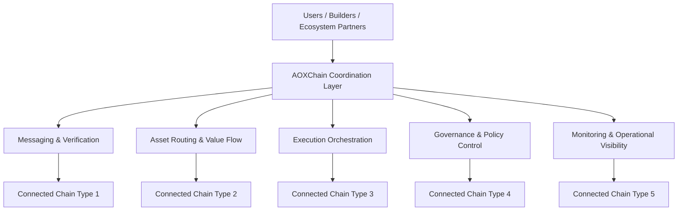

<div align="center">

# AOXChain

### A modular interoperability infrastructure for coordinated multi-chain systems.

<p>
  
  
  
  
</p>

**AOXChain is building a clear, professional and future-oriented coordination layer for blockchain ecosystems that need secure communication, structured execution and scalable interoperability.**

</div>

---

## AOXChain at a Glance

AOXChain is positioned as a **multi-chain coordination infrastructure** rather than a narrow single-environment project.

Its purpose is to create a cleaner and more durable framework for how blockchain networks exchange value, route messages, coordinate execution and maintain operational control.

Instead of growing through disconnected integrations, AOXChain is being shaped around a unified architecture with a long-term identity.

<table>
  <tr>
    <td><strong>Primary Goal</strong></td>
    <td>Build a reliable coordination layer for cross-chain communication, execution and governance.</td>
  </tr>
  <tr>
    <td><strong>Project Phase</strong></td>
    <td>Alpha stage with strong emphasis on architecture quality and long-term clarity.</td>
  </tr>
  <tr>
    <td><strong>Design Direction</strong></td>
    <td>Modular, auditable, expandable and structured for future chain integrations.</td>
  </tr>
  <tr>
    <td><strong>Strategic Vision</strong></td>
    <td>Create an interoperability framework that can evolve across multiple major chain categories without a narrative reset.</td>
  </tr>
</table>

---

## What AOXChain Solves

As blockchain ecosystems grow, the infrastructure challenge is no longer only deployment.
It is coordination.

AOXChain is being developed to address structural issues such as:

- fragmented interoperability models
- weak coordination between execution environments
- unclear governance surfaces
- poor operational transparency
- difficulty scaling architecture across multiple network types

The project aims to make cross-chain systems feel more like **engineered infrastructure** and less like loosely connected components.

---

## Core Value Proposition

<div align="center">

| Area | AOXChain Contribution |
|---|---|
| **Coordination** | A clear framework for how connected environments communicate and operate together. |
| **Execution** | A modular approach that can adapt to different execution and virtual machine models. |
| **Messaging** | Structured cross-chain event, instruction and signal flow. |
| **Governance** | More explicit administrative and policy control surfaces. |
| **Auditability** | Better visibility into system behavior, decision flow and infrastructure logic. |
| **Expansion** | Designed to connect with multiple major chain categories over time. |

</div>

---

## Architecture Perspective

AOXChain can be understood as a layered coordination model:

### 1. Coordination Layer
Defines how connected blockchain environments interact, synchronize and respect shared operating rules.

### 2. Messaging Layer
Handles cross-network communication, event propagation and signal transport in a structured way.

### 3. Execution Layer
Supports execution adaptation across different environments while keeping the broader system model consistent.

### 4. Value Routing Layer
Focuses on asset movement, representation logic and secure transfer coordination.

### 5. Governance Layer
Provides administrative control, upgrade pathways and operational policy structure.

### 6. Visibility Layer
Supports monitoring, traceability and a more auditable operational posture as the system matures.

---

## System View

```text
Users / Builders / Partners
           │
           ▼
    AOXChain Coordination
           │
   ┌───────┼────────┬────────┬────────┬────────┐
   ▼       ▼        ▼        ▼        ▼        ▼
Messaging Execution Routing Governance Visibility Expansion
           │
           ▼
 Connected Chain Categories
```

This structure reflects the intended direction of the project:
AOXChain is being built as a disciplined interoperability base that can connect with **five major chain model families** while preserving a stable architectural identity.

---

## Design Principles

- **Clarity first** — each layer should have an understandable role.
- **Deterministic thinking** — system behavior should remain as predictable and inspectable as possible.
- **Interoperability with discipline** — expansion should follow architecture, not hype.
- **Operational control** — governance and administration should be explicit, not implied.
- **Future-proof structure** — the project should be able to grow without rewriting its own story.
- **Professional presentation** — the ecosystem narrative should remain simple, aligned and credible.

---

## Alpha Positioning

AOXChain is currently in **alpha**.

That means the project is being shaped with a priority on:

- architectural foundation
- product direction clarity
- interoperability readiness
- modular scaling logic
- presentation that can remain valid as the system expands

This phase is intentionally focused.
The goal is to establish a strong framework now so future additions require less conceptual change later.

---

## Why This Presentation Matters

Many early-stage blockchain projects describe too much and explain too little.
AOXChain is taking the opposite approach.

This presentation is designed to be:

- visually clean
- easy to scan
- technically serious
- investor and partner friendly
- suitable for future ecosystem growth

It aims to communicate confidence without noise and ambition without confusion.

---

## Who AOXChain Is For

AOXChain is relevant for:

- builders designing multi-chain applications
- ecosystem partners evaluating interoperability infrastructure
- researchers studying modular blockchain coordination
- strategic contributors looking for long-term architecture quality
- communities that value systems with strong identity and expandable design
### Deterministic cross-chain infrastructure for secure value, data, and execution coordination.

<p>
  
  
  
  
</p>

> **AOXChain is an alpha-stage blockchain infrastructure initiative building a clear, modular and future-ready coordination layer for multi-chain systems.**

</div>

---

## Overview

AOXChain is designed as a next-generation coordination and interoperability foundation for blockchain ecosystems that need more than simple asset transfer.

The project focuses on building a structured system where **state movement, cross-chain messaging, execution logic, governance controls, and operational visibility** can work together in a consistent and auditable way.

Instead of presenting disconnected components, AOXChain is positioned as a **single evolving infrastructure model** with a professional architecture approach:

- **deterministic by design**
- **modular by default**
- **clear in responsibility boundaries**
- **expandable without losing control**
- **built for long-term multi-chain growth**

---

## Why AOXChain

Modern blockchain systems often face the same structural problems:

- fragmented execution environments
- inconsistent interoperability models
- unclear trust assumptions
- difficult governance coordination
- low operational transparency across networks

AOXChain exists to reduce that complexity.

It aims to provide a framework where different blockchain environments can be integrated under a more disciplined model for:

| Capability | AOXChain Focus |
|---|---|
| Cross-chain communication | Structured, verifiable message flow |
| Asset and value movement | Safer coordination across connected environments |
| Execution compatibility | Support for multiple execution models over time |
| Governance operations | Clear control surfaces and upgrade pathways |
| System visibility | Inspectable and auditable operational behavior |
| Future expansion | Prepared for additional chain categories without redesigning the core narrative |

---

## Visual System View



This model reflects the long-term direction: AOXChain is not shaped around a single isolated environment, but around a broader interoperability architecture capable of connecting **five major chain model categories** through a unified coordination philosophy.

---

## Product Direction

AOXChain is being developed as a layered system.

### 1. Coordination Core
The central logic layer responsible for defining how communication, control, and interoperability rules are applied across connected environments.

### 2. Execution Adaptation
A modular approach for supporting different virtual machine and execution model families without forcing a one-size-fits-all structure.

### 3. Messaging and Verification
A verifiable transport and validation approach for moving instructions, events, and state-related signals between environments.

### 4. Asset and Liquidity Connectivity
A foundation for coordinated asset movement, proxy representations, and secure routing logic across multiple chains.

### 5. Governance and Operational Control
An explicit control surface for upgrades, permissions, security policies, and lifecycle administration.

### 6. Observability and Auditability
A system philosophy that values traceability, transparency, and measurable operational behavior as the network expands.

---

## Core Principles

<div align="center">

| Principle | Meaning |
|---|---|
| **Clarity** | Every layer should have a visible purpose and bounded responsibility. |
| **Determinism** | State changes and coordination flows should remain understandable and reproducible. |
| **Interoperability** | Different chain architectures should be connectable through a coherent framework. |
| **Security Posture** | Expansion should never come before control, verification, and operational discipline. |
| **Scalability of Architecture** | The narrative, system model, and technical layout should remain usable as the ecosystem grows. |
| **Auditability** | Infrastructure should be inspectable not only in theory, but in actual operational practice. |

</div>

---

## Alpha Stage Positioning

AOXChain is currently in the **alpha phase**.

This means the project should be understood as:

- an evolving infrastructure initiative
- a carefully shaped architectural foundation
- a system still open to refinement
- a project building its long-term structure early and intentionally

At this stage, the emphasis is not on presenting every possible feature at once.
The emphasis is on establishing a strong base that can support future interoperability growth with minimal need for conceptual rework.

That is why the current presentation is intentionally:

- **clear rather than noisy**
- **structured rather than scattered**
- **forward-looking rather than trend-driven**
- **professional rather than speculative**

---

## What AOXChain Aims to Enable

This repository functions as the presentation layer for the AOXChain organization profile.
It exists to communicate the vision, positioning and architecture story of the project in a concise and professional format.

---

<div align="center">

## AOXChain

**Clear architecture. Structured interoperability. Long-term ecosystem direction.**
AOXChain is being shaped to support a broad range of advanced ecosystem use cases over time, including:

- cross-chain asset coordination
- multi-network application infrastructure
- chain-to-chain execution workflows
- modular settlement and routing logic
- interoperability middleware
- ecosystem governance coordination
- network-level monitoring and policy enforcement
- builder tooling for connected blockchain environments

The goal is not simply to connect systems.
The goal is to make those connections **manageable, reliable, extensible, and understandable**.

---

## Long-Term Architecture Outlook

AOXChain is being written and positioned with enough flexibility to evolve toward a larger interoperability framework without requiring a full identity rewrite later.

That long-term outlook includes:

1. **support for multiple major chain categories**
2. **separation of coordination logic from execution-specific behavior**
3. **incremental integration of new environments**
4. **clear governance and operational surfaces**
5. **an ecosystem narrative that remains stable as infrastructure expands**

This is important because many projects outgrow their original presentation.
AOXChain is being presented from the beginning in a way that can continue to make sense as the system matures.

*Built for the next generation of coordinated blockchain infrastructure.*

## For Builders, Researchers, and Strategic Partners

AOXChain is relevant for participants who care about:

- blockchain interoperability with stronger architectural discipline
- modular infrastructure design
- future-ready multi-chain coordination
- more inspectable control and governance models
- systems that can grow without becoming conceptually fragmented

If your perspective values **structure, clarity, and durable infrastructure design**, AOXChain is being built with that mindset.

---

## Repository Note

This repository serves as the organizational presentation layer for AOXChain.

It is intended to communicate the project's direction, positioning, and architectural narrative in a concise and professional format.

---

<div align="center">

## AOXChain

**A clearer path to coordinated multi-chain infrastructure.**

*Modular. Auditable. Expandable. Designed for the next phase of blockchain connectivity.*

</div>
